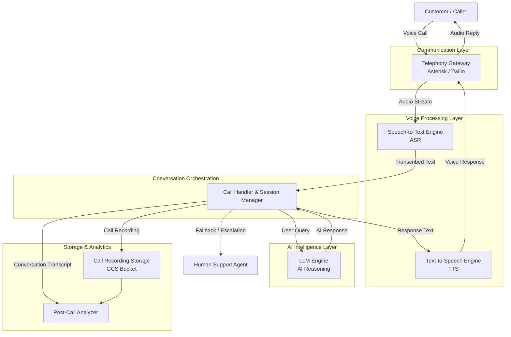

# AI-supported customer agent — system architecture

## Overview

This document describes the end-to-end call flow for an AI-supported customer agent system. Incoming calls are handled by a telephony gateway, transcribed to text, processed by an AI reasoning engine, and converted back to speech before being returned to the caller. Failed AI interactions are escalated to a human agent. All calls are stored and analysed post-call.

---

## Components

| Component | Role |
|---|---|
| **User** | The caller initiating or receiving the phone call |
| **Asterisk / Twilio** | Telephony gateway — handles inbound/outbound audio streams |
| **Speech to text (ASR engine)** | Converts caller audio into text for downstream processing |
| **Call handler / Session manager** | Central orchestrator — routes messages between all components |
| **LLM engine (AI reasoning)** | Generates AI responses based on the user's transcribed query |
| **Text to speech (TTS engine)** | Converts AI text responses into synthesised audio |
| **Human agent** | Fallback — receives escalated calls when AI cannot handle the query |
| **Post call analyzer** | Receives the full conversation transcript after call end for QA |
| **GCS bucket** | Cloud storage for uploaded call recordings |

---

## Architecture diagram

---

## Data flows

| From | To | Data |
|---|---|---|
| User | Asterisk / Twilio | User audio |
| Asterisk / Twilio | User | AI audio response |
| Asterisk / Twilio | Speech to text | Raw audio |
| Speech to text | Call handler | User text |
| Call handler | LLM engine | User query |
| LLM engine | Call handler | AI response |
| Call handler | Text to speech | AI text response |
| Text to speech | Asterisk / Twilio | Synthesised audio |
| Call handler | Human agent | Call transfer (on AI failure) |
| Call handler | Post call analyzer | Full conversation transcript |
| Call handler | GCS bucket | Call recording upload |

---

## Escalation condition

The call handler transfers to a **human agent** when the AI fails to handle the query. This is a conditional path triggered by the session manager and is not part of the standard call flow.

---

## Notes

- The **Call handler / Session manager** is the central hub — all routing decisions pass through it.
- The **TTS engine** and **ASR engine** together form the voice layer, enabling natural spoken interaction over the telephone channel.
- Post-call processing (analyzer + GCS) happens **after call end** and does not affect the live call flow.
