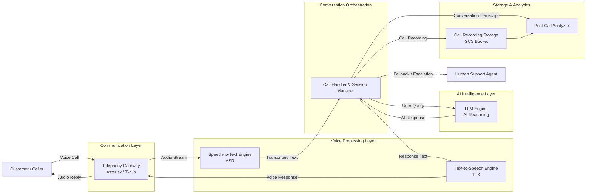

# AI-supported customer agent — system architecture

## Overview

This document describes the end-to-end call flow for an AI-supported customer agent system. Incoming calls are handled by a telephony gateway, transcribed to text, processed by an AI reasoning engine, and converted back to speech before being returned to the caller. Failed AI interactions are escalated to a human agent. All calls are stored and analysed post-call.

---

## Components

| Component | Role |
|---|---|
| **User** | The caller initiating or receiving the phone call |
| **Asterisk / Twilio** | Telephony gateway — handles inbound/outbound audio streams |
| **Speech to text (ASR engine)** | Converts caller audio into text for downstream processing |
| **Call handler / Session manager** | Central orchestrator — routes messages between all components |
| **LLM engine (AI reasoning)** | Generates AI responses based on the user's transcribed query |
| **Text to speech (TTS engine)** | Converts AI text responses into synthesised audio |
| **Human agent** | Fallback — receives escalated calls when AI cannot handle the query |
| **Post call analyzer** | Receives the full conversation transcript after call end for QA |
| **GCS bucket** | Cloud storage for uploaded call recordings |

---

## Call flow

### Normal (AI-handled) path

```
User
 │  user audio
 ▼
Asterisk / Twilio (telephony gateway)
 │  raw audio
 ▼
Speech to text (ASR engine)
 │  user text
 ▼
Call handler / Session manager
 │  user query                    AI response
 ├──────────────► LLM engine ────────────────►┤
 │                                             │
 │  AI text response                           │
 ◄─────────────────────────────────────────────┘
 │
 ▼
Text to speech (TTS engine)
 │  synthesised audio
 ▼
Asterisk / Twilio (telephony gateway)
 │  AI audio response
 ▼
User
```

### Escalation path (AI failure)

```
Call handler / Session manager
 │  AI failed — transfer to human
 ▼
Human agent
```

### Post-call path

```
Call handler / Session manager
 ├── full conversation ──► Post call analyzer
 └── upload recording  ──► GCS bucket
```

---

## Data flows

| From | To | Data |
|---|---|---|
| User | Asterisk / Twilio | User audio |
| Asterisk / Twilio | User | AI audio response |
| Asterisk / Twilio | Speech to text | Raw audio |
| Speech to text | Call handler | User text |
| Call handler | LLM engine | User query |
| LLM engine | Call handler | AI response |
| Call handler | Text to speech | AI text response |
| Text to speech | Asterisk / Twilio | Synthesised audio |
| Call handler | Human agent | Call transfer (on AI failure) |
| Call handler | Post call analyzer | Full conversation transcript |
| Call handler | GCS bucket | Call recording upload |

---

## Escalation condition

The call handler transfers to a **human agent** when the AI fails to handle the query. This is a conditional path triggered by the session manager and is not part of the standard call flow.

---

## Notes

- The **Call handler / Session manager** is the central hub — all routing decisions pass through it.
- The **TTS engine** and **ASR engine** together form the voice layer, enabling natural spoken interaction over the telephone channel.
- Post-call processing (analyzer + GCS) happens **after call end** and does not affect the live call flow.


# AI-Supported Customer Agent – Improved Architecture Flow

## Overview

This version reorganizes the system into clear functional layers so it is easier to explain to partners, stakeholders, and engineering teams.

Key improvements:

* Clear separation between telephony, AI orchestration, AI services, and analytics
* Easier-to-follow left-to-right request flow
* Explicit human handoff path
* Better naming consistency
* Reduced line crossing and visual clutter
* Clear indication of real-time vs post-call processing

---

# Recommended Architecture Diagram (Mermaid)



---

# Suggested Presentation Structure

When sharing with partners, present the architecture in 5 logical layers:

| Layer               | Responsibility                                         |
| ------------------- | ------------------------------------------------------ |
| User Layer          | Customer and human support agent                       |
| Communication Layer | Phone call routing and telephony integration           |
| Voice Processing    | Speech recognition and speech synthesis                |
| AI Orchestration    | Session handling, routing, and conversation management |
| AI Intelligence     | LLM reasoning and response generation                  |
| Analytics Layer     | Call storage, compliance, analytics, and QA            |

---

# Recommended Terminology Improvements

| Current Label                     | Recommended Label              |
| --------------------------------- | ------------------------------ |
| Asterisk/Twilio Telephony Gateway | Telephony Gateway              |
| Speech to Text ASR Engine         | Speech-to-Text Engine (ASR)    |
| Text to Speech TTS Engine         | Text-to-Speech Engine (TTS)    |
| Call Handler Session Manager      | Call Handler & Session Manager |
| LLM Engine AI Reasoning           | LLM Engine                     |
| GCS Bucket                        | Call Recording Storage         |
| Post Call Analyzer                | Post-Call Analytics Engine     |
| AI failed, Transfer to Human      | Human Escalation / Fallback    |

---

# Additional Recommendations

## 1. Distinguish Real-Time vs Post-Call Flows

Use:

* Solid arrows → Real-time audio/conversation processing
* Dashed arrows → Escalation or asynchronous flows

## 2. Add Security & Compliance Layer (Optional)

For enterprise presentations, consider adding:

* Authentication
* PII masking
* Audit logging
* Encryption
* Compliance monitoring

## 3. Add Knowledge Base / RAG (Future Enhancement)

You can extend the architecture later with:

```text
Knowledge Base / Vector DB
        ↓
LLM Engine
```

This helps explain future AI improvements.

## 4. Add Monitoring Layer

Recommended operational components:

* Metrics & Monitoring
* Call Quality Dashboard
* Failure Alerts
* Latency Tracking

---

# Partner-Friendly Summary

This system enables customers to interact with an AI-powered voice support agent over phone calls. The platform converts speech into text, processes the request through an LLM-based reasoning engine, generates responses, and converts them back into speech in real time. If the AI cannot confidently handle the request, the conversation is escalated to a human support agent. All conversations and recordings are stored for analytics, quality assurance, and post-call insights.

